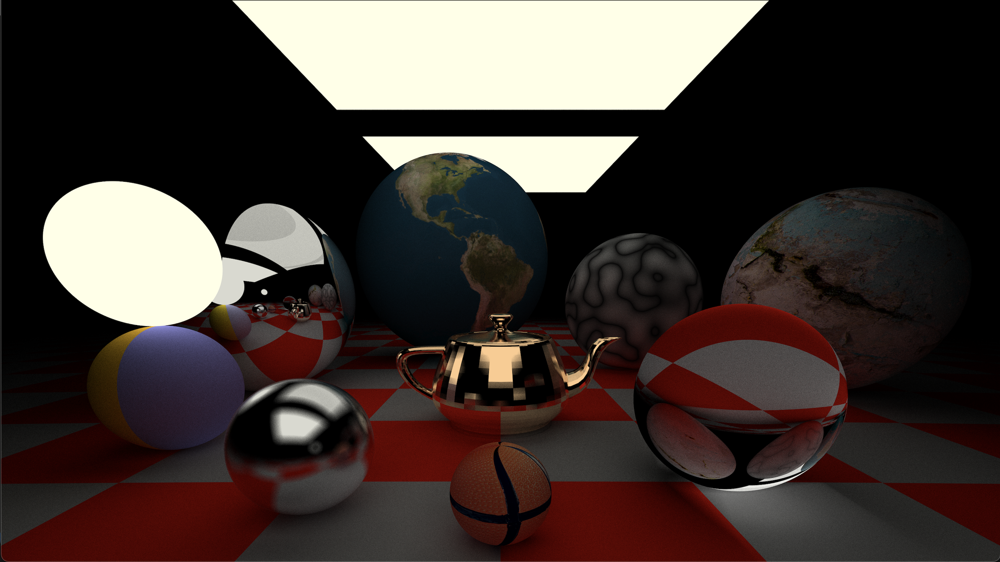

# Advanced C++ Ray Tracer

A physically-based ray tracer implemented in C++ featuring realistic lighting, materials, textures, and geometry rendering with BVH acceleration.



## Features

### 🎨 **Materials & Shading**
- **Lambertian (Diffuse)**: Realistic matte surfaces with customizable reflectivity
- **Metal**: Reflective surfaces with adjustable fuzziness for realistic metal rendering
- **Dielectric (Glass)**: Transparent materials with refraction and reflection
- **Emissive Materials**: Light-emitting surfaces for realistic illumination

### 🖼️ **Advanced Texturing**
- **Solid Colors**: Basic color textures
- **Procedural Noise**: Perlin noise-based textures for natural-looking surfaces
- **Checker Patterns**: Configurable checkerboard textures
- **Image Textures**: Support for loading external images (JPG format)
- **UV Mapping**: Proper texture coordinate mapping for spheres and other primitives

### 🎯 **Geometry Support**
- **Spheres**: With proper UV mapping for textures
- **Triangles**: Individual triangle primitives
- **Quads**: Quadrilateral surfaces for walls, floors, etc.
- **OBJ File Loading**: Import complex 3D models from OBJ file and renders trianlge mesh

### ⚡ **Performance Optimization**
- **BVH (Bounding Volume Hierarchy)**: Efficient ray-object intersection acceleration
- **AABB (Axis-Aligned Bounding Boxes)**: Fast spatial partitioning
- **Multi-sampling**: Configurable anti-aliasing with samples per pixel

### 🔍 **Advanced Ray Tracing Features**
- **Recursive Ray Bounces**: Realistic light transport with configurable depth
- **Gamma Correction**: Proper color space handling for realistic output
- **Depth of Field**: Camera focus effects (infrastructure present)
- **Anti-aliasing**: Multi-sample anti-aliasing for smooth edges

### 📷 **Camera System**
- **Flexible Positioning**: Full camera control
- **Field of View**: Adjustable perspective
- **Aspect Ratio Support**: Configurable output dimensions
- **Look-at System**: Intuitive camera aiming

## Getting Started

### Prerequisites
- C++11 compatible compiler (g++, clang++)
- STB Image library (included as `rtw_stb_image.h`)

### Compilation
```bash
g++ -std=c++11 project.cpp camera.cpp rtw_stb_image.cpp -o raytracer
```

### Basic Usage
```bash
# Render the default scene
./raytracer teapot.obj

# Render with a custom OBJ model
./raytracer model.obj
```

The program will output a PPM image file named `output.ppm`.

## Scene Configuration

The main scene is configured in `project.cpp`. You can customize:

### Materials
```cpp
// Create different materials
dielectric *glass_mat = new dielectric(1.5, 0.8);          // Glass with refraction
lambertian *noise_mat = new lambertian(perlin_texture, 0.85); // Textured surface
metal *metal_mat = new metal(grey, 1.0, 0.0);           // Shiny metal
diffuse_light *light_mat = new diffuse_light(&light_texture); // Light source
```

### Geometry
```cpp
// Add spheres with different materials
hittables.push_back(new Sphere(vec3(0.0, 0.8, 6.0), 0.8, basketball_mat));
hittables.push_back(new Sphere(vec3(4.5, 1.8, 4.0), 1.8, glass_mat));

// Add quad lights
hittables.push_back(new Quad(vec3(-8.0, 12.0, 8.0), vec3(16, 0, 0), vec3(0, 0, 16), light_mat));
```

### Camera Settings
```cpp
vec3 camera_position(0.0, 4.0, 12.0);
vec3 look_at(0.0, 0.0, -1.0);
vec3 up(0.0, -1.0, 0.0);
double fov = 65.0;
int samples = 120;  // Higher = better quality, slower render
```

## File Structure

- **`project.cpp`** - Main program and scene setup
- **`camera.h/cpp`** - Camera implementation and rendering pipeline
- **`ray.h`** - Ray class with reflection/refraction utilities
- **`vec3.h`** - 3D vector mathematics 
- **`color.h`** - Color handling with gamma correction
- **`material.h`** - Material system (Lambertian, Metal, Dielectric, Emissive)
- **`texture.h`** - Texture system (Solid, Noise, Checker, Image)
- **`hittable.h`** - Base class for renderable objects
- **`sphere.h`** - Sphere primitive implementation
- **`triangle.h`** - Triangle primitive with Möller-Trumbore intersection
- **`quad.h`** - Quad primitive 
- **`hittable_list.h`** - Object collections with OBJ file loading
- **`bvh.h`** - Bounding Volume Hierarchy acceleration structure
- **`aabb.h`** - Axis-Aligned Bounding Box implementation
- **`util.h`** - Utility functions 
- **`perlin.h`** - Perlin noise implementation 

## Supported Texture Files

Place texture files in the images directory:
- `earth.jpg` - Earth texture for planetary rendering
- `wall.jpg` - Wall texture
- `basketball-ball.jpg` - Basketball texture
- Any JPG files for image textures

## Performance Notes

The ray tracer includes several optimizations:
- **BVH Acceleration**: Logarithmic intersection testing for complex scenes
- **Configurable Quality**: Adjust `samples_per_pixel` vs render time
- **Image Resolution**: Modify `IW` constant in `project.cpp` (240, 480, 960, 1920, 3840)

### Render Quality Settings
- **Fast Preview**: 10-30 samples, 480px width
- **Production**: 100-500+ samples, 1920px+ width
- **High Quality**: 1000+ samples for final renders

## Example Scenes

The default scene includes:
- Textured Earth sphere with image mapping
- Glass sphere with realistic refraction
- Metal spheres with varying fuzziness
- Procedural noise textures
- Checkered ground plane
- Area lights for realistic illumination
- Optional OBJ model loading

## Known Issues

- Motion blur - supported for spheres, but deprecated (Notes in sphere.h)
- BVH performance may degrade with very dense triangle meshes
- OBJ loader supports basic triangular faces only

## Future Enhancements

Potential improvements for the ray tracer:
- Volumetric rendering (fog, smoke)
- Subsurface scattering
- Advanced lighting models (PBR)
- GPU acceleration
- Real-time preview
- More primitive types (cylinders, torus, etc.)

## Contributing

This ray tracer demonstrates advanced computer graphics concepts including:
- Monte Carlo path tracing
- Physically-based materials
- Spatial acceleration structures
- Texture mapping and procedural generation
- Advanced intersection algorithms

Feel free to extend and modify for educational or personal projects!
